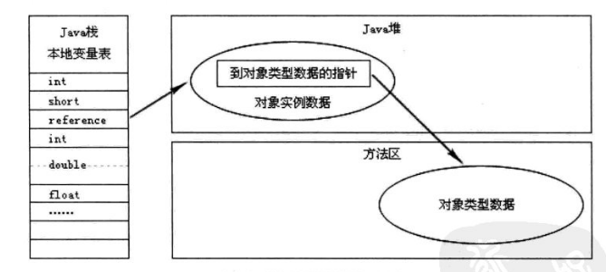

# Java 内存区域与内存溢出

## 内存区域

Java 虚拟机在执行 Java 程序的过程中会把他所管理的内存划分为若干个不同的数据区域。Java 虚拟机规范将 JVM 所管理的内存分为以下几个运行时数据区：程序计数器、Java 虚拟机栈、本地方法栈、Java 堆、方法区。下面详细阐述各数据区所存储的数据类型。


### 程序计数器

一块较小的内存空间，它是当前线程所执行的字节码的行号指示器，字节码解释器工作时通过改变该计数器的值来选择下一条需要执行的字节码指令，分支、跳转、循环等基础功能都要依赖它来实现。每条线程都有一个独立的的程序计数器，各线程间的计数器互不影响，因此该区域是线程私有的。

当线程在执行一个 Java 方法时，该计数器记录的是正在执行的虚拟机字节码指令的地址，当线程在执行的是 Native 方法（调用本地操作系统方法）时，该计数器的值为空。另外，该内存区域是唯一一个在 Java 虚拟机规范中么有规定任何 OOM（内存溢出：OutOfMemoryError）情况的区域。

### Java 虚拟机栈

该区域也是线程私有的，它的生命周期也与线程相同。虚拟机栈描述的是 Java 方法执行的内存模型：每个方法被执行的时候都会同时创建一个栈帧，栈它是用于支持续虚拟机进行方法调用和方法执行的数据结构。对于执行引擎来讲，活动线程中，只有栈顶的栈帧是有效的，称为当前栈帧，这个栈帧所关联的方法称为当前方法，执行引擎所运行的所有字节码指令都只针对当前栈帧进行操作。栈帧用于存储局部变量表、操作数栈、动态链接、方法返回地址和一些额外的附加信息。在编译程序代码时，栈帧中需要多大的局部变量表、多深的操作数栈都已经完全确定了，并且写入了方法表的 Code 属性之中。因此，一个栈帧需要分配多少内存，不会受到程序运行期变量数据的影响，而仅仅取决于具体的虚拟机实现。

在 Java 虚拟机规范中，对这个区域规定了两种异常情况：

- 如果线程请求的栈深度大于虚拟机所允许的深度，将抛出StackOverflowError异常。
- 如果虚拟机在动态扩展栈时无法申请到足够的内存空间，则抛出OutOfMemoryError异常。

这两种情况存在着一些互相重叠的地方：当栈空间无法继续分配时，到底是内存太小，还是已使用的栈空间太大，其本质上只是对同一件事情的两种描述而已。在单线程的操作中，无论是由于栈帧太大，还是虚拟机栈空间太小，当栈空间无法分配时，虚拟机抛出的都是 StackOverflowError 异常，而不会得到 OutOfMemoryError 异常。而在多线程环境下，则会抛出 OutOfMemoryError 异常。

**下面详细说明栈帧中所存放的各部分信息的作用和数据结构。**

1、局部变量表

局部变量表是一组变量值存储空间，用于存放方法参数和方法内部定义的局部变量，其中存放的数据的类型是编译期可知的各种基本数据类型、对象引用（reference）和 returnAddress 类型（它指向了一条字节码指令的地址）。局部变量表所需的内存空间在编译期间完成分配，即在 Java 程序被编译成 Class 文件时，就确定了所需分配的最大局部变量表的容量。当进入一个方法时，这个方法需要在栈中分配多大的局部变量空间是完全确定的，在方法运行期间不会改变局部变量表的大小。

局部变量表的容量以变量槽（Slot）为最小单位。在虚拟机规范中并没有明确指明一个 Slot 应占用的内存空间大小（允许其随着处理器、操作系统或虚拟机的不同而发生变化），一个 Slot 可以存放一个32位以内的数据类型：boolean、byte、char、short、int、float、reference 和 returnAddresss。reference 是对象的引用类型，returnAddress 是为字节指令服务的，它执行了一条字节码指令的地址。对于 64 位的数据类型（long和double），虚拟机会以高位在前的方式为其分配两个连续的 Slot 空间。

虚拟机通过索引定位的方式使用局部变量表，索引值的范围是从 0 开始到局部变量表最大的 Slot 数量，对于 32 位数据类型的变量，索引 n 代表第 n 个 Slot，对于 64 位的，索引 n 代表第 n 和第 n+1 两个 Slot。

在方法执行时，虚拟机是使用局部变量表来完成参数值到参数变量列表的传递过程的，如果是实例方法（非static），则局部变量表中的第 0 位索引的 Slot 默认是用于传递方法所属对象实例的引用，在方法中可以通过关键字“this”来访问这个隐含的参数。其余参数则按照参数表的顺序来排列，占用从1开始的局部变量 Slot，参数表分配完毕后，再根据方法体内部定义的变量顺序和作用域分配其余的 Slot。

局部变量表中的 Slot 是可重用的，方法体中定义的变量，作用域并不一定会覆盖整个方法体，如果当前字节码PC计数器的值已经超过了某个变量的作用域，那么这个变量对应的 Slot 就可以交给其他变量使用。这样的设计不仅仅是为了节省空间，在某些情况下 Slot 的复用会直接影响到系统的而垃圾收集行为。

2、操作数栈

操作数栈又常被称为操作栈，操作数栈的最大深度也是在编译的时候就确定了。32 位数据类型所占的栈容量为 1,64 位数据类型所占的栈容量为 2。当一个方法开始执行时，它的操作栈是空的，在方法的执行过程中，会有各种字节码指令（比如：加操作、赋值元算等）向操作栈中写入和提取内容，也就是入栈和出栈操作。

Java 虚拟机的解释执行引擎称为“基于栈的执行引擎”，其中所指的“栈”就是操作数栈。因此我们也称 Java 虚拟机是基于栈的，这点不同于 Android 虚拟机，Android 虚拟机是基于寄存器的。

基于栈的指令集最主要的优点是可移植性强，主要的缺点是执行速度相对会慢些；而由于寄存器由硬件直接提供，所以基于寄存器指令集最主要的优点是执行速度快，主要的缺点是可移植性差。

3、动态连接

每个栈帧都包含一个指向运行时常量池（在方法区中，后面介绍）中该栈帧所属方法的引用，持有这个引用是为了支持方法调用过程中的动态连接。Class 文件的常量池中存在有大量的符号引用，字节码中的方法调用指令就以常量池中指向方法的符号引用为参数。这些符号引用，一部分会在类加载阶段或第一次使用的时候转化为直接引用（如 final、static 域等），称为静态解析，另一部分将在每一次的运行期间转化为直接引用，这部分称为动态连接。

4、方法返回地址

当一个方法被执行后，有两种方式退出该方法：执行引擎遇到了任意一个方法返回的字节码指令或遇到了异常，并且该异常没有在方法体内得到处理。无论采用何种退出方式，在方法退出之后，都需要返回到方法被调用的位置，程序才能继续执行。方法返回时可能需要在栈帧中保存一些信息，用来帮助恢复它的上层方法的执行状态。一般来说，方法正常退出时，调用者的 PC 计数器的值就可以作为返回地址，栈帧中很可能保存了这个计数器值，而方法异常退出时，返回地址是要通过异常处理器来确定的，栈帧中一般不会保存这部分信息。

方法退出的过程实际上等同于把当前栈帧出站，因此退出时可能执行的操作有：恢复上层方法的局部变量表和操作数栈，如果有返回值，则把它压入调用者栈帧的操作数栈中，调整 PC 计数器的值以指向方法调用指令后面的一条指令。

### 本地方法栈

该区域与虚拟机栈所发挥的作用非常相似，只是虚拟机栈为虚拟机执行 Java 方法服务，而本地方法栈则为使用到的本地操作系统（Native）方法服务。

### Java 堆

Java Heap 是 Java 虚拟机所管理的内存中最大的一块，它是所有线程共享的一块内存区域。几乎所有的对象实例和数组都在这类分配内存。Java Heap 是垃圾收集器管理的主要区域，因此很多时候也被称为“GC堆”。

根据 Java 虚拟机规范的规定，Java 堆可以处在物理上不连续的内存空间中，只要逻辑上是连续的即可。如果在堆中没有内存可分配时，并且堆也无法扩展时，将会抛出 OutOfMemoryError 异常。  

### 方法区

方法区也是各个线程共享的内存区域，它用于存储已经被虚拟机加载的类信息、常量、静态变量、即时编译器编译后的代码等数据。方法区域又被称为“永久代”，但这仅仅对于 Sun HotSpot 来讲，JRockit 和 IBM J9 虚拟机中并不存在永久代的概念。Java 虚拟机规范把方法区描述为 Java 堆的一个逻辑部分，而且它和 Java Heap 一样不需要连续的内存，可以选择固定大小或可扩展，另外，虚拟机规范允许该区域可以选择不实现垃圾回收。相对而言，垃圾收集行为在这个区域比较少出现。该区域的内存回收目标主要针是对废弃常量的和无用类的回收。运行时常量池是方法区的一部分，Class 文件中除了有类的版本、字段、方法、接口等描述信息外，还有一项信息是常量池（Class文件常量池），用于存放编译器生成的各种字面量和符号引用，这部分内容将在类加载后存放到方法区的运行时常量池中。运行时常量池相对于 Class 文件常量池的另一个重要特征是具备动态性，Java 语言并不要求常量一定只能在编译期产生，也就是并非预置入 Class 文件中的常量池的内容才能进入方法区的运行时常量池，运行期间也可能将新的常量放入池中，这种特性被开发人员利用比较多的是 String 类的 intern（）方法。

根据 Java 虚拟机规范的规定，当方法区无法满足内存分配需求时，将抛出 OutOfMemoryError 异常。 

### 直接内存

直接内存并不是虚拟机运行时数据区的一部分，也不是 Java 虚拟机规范中定义的内存区域，它直接从操作系统中分配，因此不受 Java 堆大小的限制，但是会受到本机总内存的大小及处理器寻址空间的限制，因此它也可能导致 OutOfMemoryError 异常出现。在 JDK1.4 中新引入了 NIO 机制，它是一种基于通道与缓冲区的新 I/O 方式，可以直接从操作系统中分配直接内存，即在堆外分配内存，这样能在一些场景中提高性能，因为避免了在 Java 堆和 Native 堆中来回复制数据。

## 内存溢出

下面给出个内存区域内存溢出的简单测试方法。


这里有一点要重点说明，在多线程情况下，给每个线程的栈分配的内存越大，反而越容易产生内存溢出异常。操作系统为每个进程分配的内存是有限制的，虚拟机提供了参数来控制 Java 堆和方法区这两部分内存的最大值，忽略掉程序计数器消耗的内存（很小），以及进程本身消耗的内存，剩下的内存便给了虚拟机栈和本地方法栈，每个线程分配到的栈容量越大，可以建立的线程数量自然就越少。因此，如果是建立过多的线程导致的内存溢出，在不能减少线程数的情况下，就只能通过减少最大堆和每个线程的栈容量来换取更多的线程。
    
另外，由于 Java 堆内也可能发生内存泄露（Memory Leak），这里简要说明一下内存泄露和内存溢出的区别：

内存泄露是指分配出去的内存没有被回收回来，由于失去了对该内存区域的控制，因而造成了资源的浪费。Java 中一般不会产生内存泄露，因为有垃圾回收器自动回收垃圾，但这也不绝对，当我们 new 了对象，并保存了其引用，但是后面一直没用它，而垃圾回收器又不会去回收它，这边会造成内存泄露，

内存溢出是指程序所需要的内存超出了系统所能分配的内存（包括动态扩展）的上限。

## 对象实例化分析

对内存分配情况分析最常见的示例便是对象实例化:

```
Object obj = new Object();
```

这段代码的执行会涉及 Java 栈、Java 堆、方法区三个最重要的内存区域。假设该语句出现在方法体中，及时对 JVM 虚拟机不了解的 Java 使用这，应该也知道 obj 会作为引用类型（reference）的数据保存在 Java 栈的本地变量表中，而会在 Java 堆中保存该引用的实例化对象，但可能并不知道，Java 堆中还必须包含能查找到此对象类型数据的地址信息（如对象类型、父类、实现的接口、方法等），这些类型数据则保存在方法区中。

另外，由于 reference 类型在 Java 虚拟机规范里面只规定了一个指向对象的引用，并没有定义这个引用应该通过哪种方式去定位，以及访问到 Java 堆中的对象的具体位置，因此不同虚拟机实现的对象访问方式会有所不同，主流的访问方式有两种：使用句柄池和直接使用指针。

通过句柄池访问的方式如下：


通过直接指针访问的方式如下：



这两种对象的访问方式各有优势，使用句柄访问方式的最大好处就是 reference 中存放的是稳定的句柄地址，在对象被移动（垃圾收集时移动对象是非常普遍的行为）时只会改变句柄中的实例数据指针，而 reference 本身不需要修改。使用直接指针访问方式的最大好处是速度快，它节省了一次指针定位的时间开销。目前 Java 默认使用的 HotSpot 虚拟机采用的便是是第二种方式进行对象访问的。